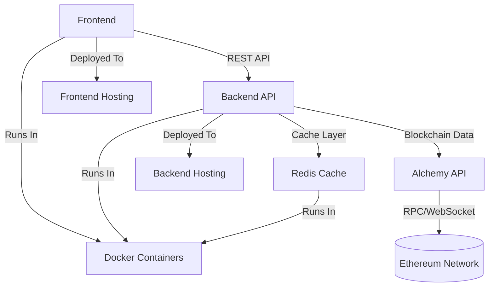

# Local Development & Execution Guide

## Prerequisites

- Docker & Docker Compose installed
- Node.js (for frontend development, optional if using Docker)
- Python 3.14+ (for backend development, optional if using Docker)

## Quick Start (Recommended: Docker Compose)

1. Clone the repository:
   ```sh
   git clone git@github.com:jbtwist/eth_crawler.git
   cd eth_crawler
   ```

2. Copy and configure environment variables:
   ```sh
   cp backend/.env.sample backend/.env
   cp frontend/.env.sample frontend/.env

   # Edit backend/.env with your Alchemy API key and other settings
   ```

3. Start all services (frontend, backend, redis) with Docker Compose:
   ```sh
   docker-compose up --build
   ```

4. Access the app:
   - Frontend: http://localhost:5173
   - Backend API: http://localhost:8000/docs
   - Redis: localhost:6379 (internal)

## Manual Local Development

### Backend
1. Install Python dependencies:
   ```sh
   cd backend
   python3 -m venv .venv
   source .venv/bin/activate
   pip install uv
   uv sync
   ```
2. Start FastAPI server:
   ```sh
   uvicorn app.main:app --reload --host 0.0.0.0 --port 8000
   ```

### Frontend
1. Install Node dependencies:
   ```sh
   cd frontend
   npm install
   ```
2. Start Vite dev server:
   ```sh
   npm run dev
   ```

### Redis
Start Redis locally (if not using Docker):
```sh
redis-server
```

---

## MVP Architecture



---

# Thought process and decision making
## Architecture

When approaching this project, my initial instinct was to design an architecture that could simulate an enterprise-level application. However, it quickly became clear that such complexity would be disproportionate for the scope and goals of a relatively small project. Instead, I opted for a pragmatic approach, focusing on simplicity and maintainability without sacrificing scalability.

To interact with the blockchain, I chose to rely on an external service—Alchemy—which offers robust APIs and native integration with Web3.py. This decision eliminated the need to manage a local node, streamlining both development and operational overhead.

## Backend

For the backend, FastAPI provided a modern and efficient framework, while Redis was introduced as a caching layer to reduce redundant blockchain queries and improve response times. Although a more sophisticated caching strategy could be implemented—such as persistently storing frequently accessed addresses and updating them automatically—I determined that a basic cache would suffice for the purposes of this assessment. The cache configuration is intentionally simple, primarily to demonstrate the concept rather than to optimize for real-world blockchain update intervals.

## Frontend

On the frontend, my experience has typically involved React Router for navigation. However, while searching for a suitable datatable widget, I discovered the TanStack suite and decided to leverage its Datatable, Query, and Router libraries. This choice allowed me to build a modern and maintainable frontend, even though the application only required a single endpoint. For simplicity, I chose to use direct fetch calls rather than introducing Axios or other HTTP clients.

## Docker

Finally, I created straightforward Dockerfiles and a Docker Compose configuration to facilitate local development and potential deployment. While these containers could be adapted for use in a Kubernetes environment, I ultimately decided to deploy the application to Vercel, prioritizing ease of use and cost-effectiveness given the project's requirements.

