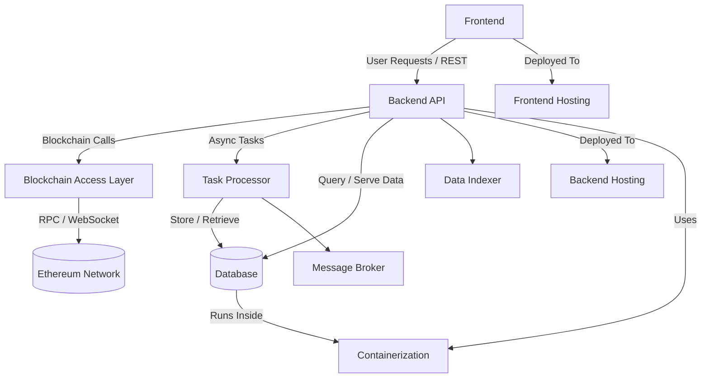

## MVP Architecture

```mermaid
graph TD;
A[Frontend]
B[Backend API]
C[Blockchain Access Layer]
D[Task Processor]
E[(Database)]
F[(Ethereum Network)]
G[Data Indexer]
H[Message Broker]
I[Containerization]
J[Backend Hosting]
K[Frontend Hosting]

A -->|User Requests / REST| B
B -->|Blockchain Calls| C
C -->|RPC / WebSocket| F
B -->|Async Tasks| D
D -->|Store / Retrieve| E
B -->|Query / Serve Data| E
B --> G
D --> H
A -->|Deployed To| K
B -->|Deployed To| J
E -->|Runs Inside| I
B -->|Uses| I
```